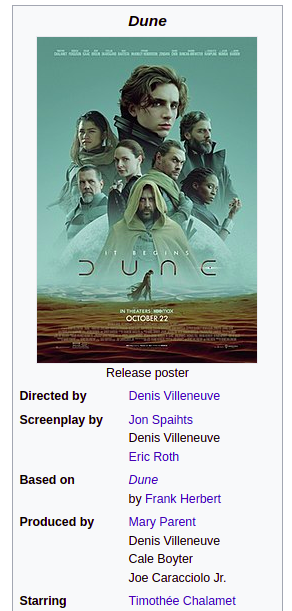

**A slightly unusual story of a _fail I am not too angry with_.**

TL;DR: On the road ...WHY SHOULD I READ THIS → look into infoboxes parsing in the FIRST paragraph

It was a part of the effort to create some sort of [query language](https://github.com/zverok/wikipedia_ql) for fetching data from the Wikipedia. I've been on-and-off the idea for half a year, but just recently decided to give it more systematic resource. To make myself stay on track, I decided to [describe my path as I go](https://zverok.substack.com/p/wikipedia-and-irregular-data-how).

By that time, the base was [essentially in place](https://zverok.substack.com/p/wikipediaql-1): I wanted Wikipedia pages to be queriable in CSS-selector-alike language, to incorporate content semantic-level selectors into it (sections, sentence, etc.), and, most crucially, making it one expression to select most common and useful type of data.

As I [started](https://zverok.substack.com/p/wikipedia-and-irregular-data-how) with that describe-as-I-go approach, it gave insights to straighten up a few loose parts of the language that were hard to explain. It also gave the possibility to estimate the effort that would be necessary to take to describe internally complex structures with simple and easy to remember expressions.

After that last chapter (some three weeks ago, sorry, life catches us sometimes!), I proudly announced:

> Extend dictionary of supported selectors/concepts for some time: we need at the very least infoboxes and hatnotes; most probably, some of the other formalized elements, like navboxes.

And that's where the things went weird.

## The problem

So, what are those "[infoboxes](https://en.wikipedia.org/wiki/Wikipedia:Manual_of_Style/Infoboxes)" and why are they so important?

It is a term to designate the most _seemingly_ formal part of the Wikipedia article:

That's the part of Wikipedia that creates a temptation to parse—and that's how I was hooked up too, many years ago. Wikipedia infoboxes were my very first guess when [I imagined](https://zverok.substack.com/p/wikipedia) that API like `World.country("Ukraine").attr("area")` should be available in open programming languages, using an open data sources.

That's why my very first project—Wikipedia parser for Ruby, still alive and quite powerful—was called [Infoboxer](https://github.com/molybdenum-99/infoboxer). Its scope quickly grew much wider than this part of the page, but the name stuck.

And so, I was returning to where it all started: looking into Wikipedia infoboxes parsing for WikipediaQL query language, and trying to design parsing primitives for it—in a slow realtime, while writing this article.

When I started to write, the working title was _"Fantastic Wikipedia Infoboxes and How To Parse Them"_. Not the freshest approach, but it seemed to fit.

By the end of the article/new version development, I expected to have some new neat `infobox` _selector_ (or maybe a few related ones). The details of how exactly it would be used to describe data were still unclear, but that's what "write about it, then implement" approach is for!

## The implementation effort

So, I just opened some page and absentmindedly started to try to extract data from it with the tools I already had—expecting it to _not_ work (or be extremely clumsy), so I'll know where to look for a missing parts.

To my slight awe, it was actually OK.

EXAMPLE

It is somewhat wordy (the wordiness is acceptable for occasionally-read language, I assume), but otherwise quite to-the-point: looking at it as just usual table, and using already designed tools, one doesn't need anything infobox-specific to fetch data.

I went to several more pages. The same extraction statement worked perfectly fine, both for turning the entire infobox into structured data, and for "extract some particular value by name":

EXAMPLE

Finally, I met the infobox that doesn't correspond to the model at all, still staying structured (WWII):

But after some consideration, I remembered I had another trick up my sleeve: table parsing heuristic I planned but not yet implemented on the previous approach to tables. What if table "normalization" would automatically turn mid-table full-row `th` into a row-level `th` for all subsequent rows? In other word, `table-data` pseudo-selector was adjusted to perceive the table above as this:

And that was all we needed to fetch some data from the table:

> Interestingly enough, both "structured data from Wikipedia" services—Wikidata and DBPedia—seem to fail to structure this part of the page. Which probably implies we are onto something here!

With that, and going through many more pages, it seemed... Good enough? I even spent several hours creating the [showcase page](TODO)—mostly to document the approach, but also, to persuade my baffled self that it really works this way.

But wait, where is my cool `infobox` primitive to design?!

## The fail?

As stated in the first paragraph, I am not **angry** at a fail to design new primitive, but still feel a bit uneasy about it. My old Wikipedia parsing project had "infobox" in its name—and the second one even wouldn't have it is a named construct?!

But it also shifted my perspective significantly.

The "revelation" that led to WikipediaQL birth was sudden understanding that Wikipedia's HTML is much more regular and predictable than its source markup that I spent a good chunk of my 30th parsing. The "infoboxes fail", from a certain point of view, is just logical.

There are many discrepancies between HTML DOM model and perceived data model of Wikipedia page that make straightforward web-scraping too tedious task. I initially assumed that following the Wikipedia-specific structuring is the best way to handle this discrepancies.

I thought that making infobox, navbox, hatnote, OTHERS first-class scraping primitives is the only way forward.

But it seems that the useful approach is more subtle. As _accidental usefulness_ of `table-data` shows, we probably can stay in "almost generic DOM" domain, enhancing it with some good heuristics on how MediaWiki content is usually structured.

This will lead to much smaller and more conventional "dictionary"—which is also easier to master for library users. All in all, I need to remember the terms for page elements like "infobox" is a domain language of Wikipedia maintainers, not of readers.

There are still some possibilities I consider when looking at infoboxes (I spent too many years with them to let them go easily!) One of them is introducing shortcuts/aliases in WikipediaQL. One might want to do something like `infobox["Born"]` instead of writing `table.infobox >> table-data >> td[row="Born"]`.

In any case, it is something to think about down the road: well-chosen base is more important to me now than rapidly grow the language to handle any demo-friendly case with just one word.

## What's next

I am not sure. Designing the thing that has so many _cool potential purposes_ makes one greedy to invent all the features in the world. Programmers gonna program, you know.

The initial assumption behind the WikipediaQL is that the most non-trivial and useful part of it needs to be Wikipedia-specific, talking in parlance of infoboxes, navboxes, hatnotes, and such. But the encounter with the "no need for infoboxes" revelation led me to rethink my course for now.

(As well as—to be honest—the fact that I am still not sure the project will find its users. It is fun to develop, though!)

I'll try to look the new direction opened: maybe the generic-from-the-beginning is actually better? There are several equally useful albeit less known wikis. My favorite is [Wikivoyage](https://en.wikivoyage.org/wiki/Main_Page) which grew into a go-to resource for initial acquitance with a new place when traveling. [Wiktionary](https://en.wikivoyage.org/wiki/Main_Page) is quite cool too!

_Also, I always liked the [Fandom](https://tardis.fandom.com/wiki/Doctor_Who_Wiki) (nee Wikia) rich set of cause-dedicated wikis; but unsure whether I want to get involved with them for experiments and demos. For one, the site is so ad-ridden now my Chrome almost dying, even with AdBlock. Another cause is that they seem to not advertise the MediaWiki API, and the [REST part](https://www.mediawiki.org/wiki/API:REST_API) is not implemented/disabled there. WikipediaQL uses this API for page source fetching, though there are alternative approaches._

So, next time I might look into what it takes to apply WikipediaQL to other MediaWiki installations, starting from Wikipedias in languages other than English, and going sideways from there. We'll see!

**I am eager for the feedback, please don't hesitate to drop me a line on anything related to the library or to my writing!**
