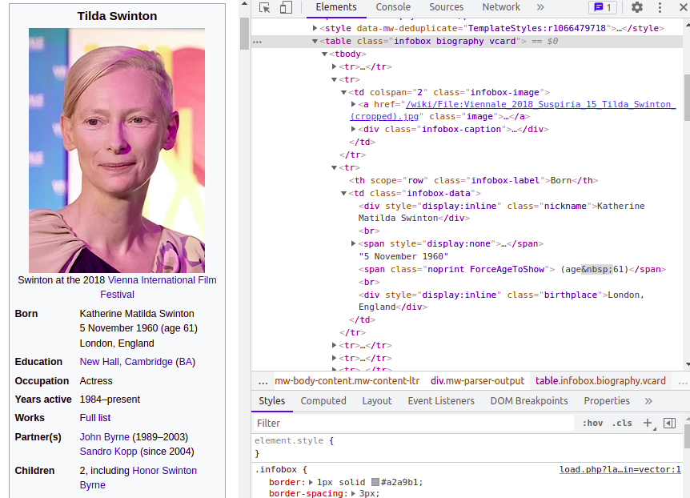

> This is a part of a blog post series about "useless" (or: controversial) syntax elements that emerged in recent Ruby version. The goal of the series is not to defend (or criticize) the features, but to share a "thought framework" for analysis of their reasons, design, and effect the new syntax has on a code that uses it. See also [intro/ToC post](https://zverok.space/blog/2023-10-02-syntax-sugar.html).

Today's topic is a small one, yet, nevertheless, the one that invoked a lot of mixed feelings: an ability to **omit hash[^1] or keyword argument values**.

[^1]: For curious readers who are other languages' users: in Ruby, we historically call "[Hash](https://docs.ruby-lang.org/en/3.2/Hash.html)" what others call "dictionary" or "map." Confusing, I know (and no less confusing for those who started from Ruby and then tried to use its terminology outside), but that's how things are! Oh, and while we are on it: we call "keyword arguments" what in many other languages is known as "named arguments."

## What

Since [Ruby 3.1](https://rubyreferences.github.io/rubychanges/3.1.html#values-in-hash-literals-and-keyword-arguments-can-be-omitted), this code works:

```ruby
x = 5
# Constructing a hash
h = {x:}  # same as `h = {x: x}`
#=> {x: 5}

def distance_to(x:, y:)
  # ...
end

# Implicitly passes `x: 5`
distance_to(x:, y: 10)
```

This works for any locally-available name, like methods and constants, too:
```ruby
def m = "method result"
C = 3

{C:, m:}
# {:C=>3, :m=>"method result"}
```

## Why

The surface reason for wanting this feature is more or less obvious: if you type a lot of `{id: id, user: user, payload: payload}`, it might feel dumb and unnecessary: why should I repeat what's **obvious** and can unambiguously be guessed by the computer?

The interesting questions to ask, though, are the following: is there a lot of code looking like this? If so, why? (And maybe it is some kind of smell to be removed, not optimized?)

The answer to the first one is simple: yes, there is a whole lot. In Ruby's [standard](https://github.com/ruby/ruby/blob/v3_2_0/lib/csv.rb#L1971-L1980) [library](https://github.com/ruby/ruby/blob/v3_2_0/lib/fileutils.rb#L716), in [Rails](https://github.com/rails/rails/blob/v7.1.0/activerecord/lib/active_record/connection_adapters/abstract/transaction.rb#L430), in [Rubocop](https://github.com/rubocop/rubocop/blob/master/lib/rubocop/cop/style/array_intersect.rb#L108)-The-Fearsome-Linter (whose maintainer [hated the feature](https://batsov.com/articles/2022/01/20/bad-ruby-hash-value-omission/), FTR), and in any production codebase I saw, there are typically tons of passing around hashes and calling methods with keyword arguments.

And yes, frequently, those hashes/keyword arguments are gathered from locally available values with names that match the respective keys. (I would boldly say that the _absence_ of such constructs frequently signals a legacy code, or very specific—frequently low-level—contexts, or, at least, a conscious personal style.)

**But why this happens so much?** We can identify some external and internal reasons.

The main **external** reason is Ruby nowadays is used mostly for Web applications and some data processing (in extent needed for Web applications, mostly), and this means accepting, parsing, passing around, and building a lot of JSON, i.e., mostly dictionaries with string[^2] keys. Not even necessary JSON—modern web software is notable for tossing around big nested semi-formal tree structures.

[^2]: However, in Ruby, we frequently uses a separate type [Symbol](https://docs.ruby-lang.org/en/3.2/Symbol.html) for keys.

But **internal** reasons are more interesting and more multi-faceted.

The way that keyword arguments were introduced in Ruby is quite interesting (and seems to be unlike most  other modern languages, but we'll get to it in further sections):

Before Ruby 2.0, there were none. The named arguments _on the caller's side_, though, could've been imitated by the relaxed language syntax that allowed to omit `{}` around the hash if it was the last argument:

```ruby
File.open('data.bin', mode: 'b')
```
This looks like a call with two arguments: "positional" one and "named" one with the name `mode:`, but is actually fully equivalent to:
```ruby
File.open('data.bin', {mode: 'b'})
```
...with `open` method that can be defined as:
```ruby
def open(path, options)
  # `options` will be a hash `{mode: 'b'}`
```

The "caller side" of things looked quite elegant, and at that point, it already became popular for DSLs like
```ruby
validate :field, presence: true
```
...and passing around packs of optional values (like parameters for HTTP requests).

The minimalism of this solution is appealing (a "big" language feature with no explicit concept), so when the "real" keyword arguments were introduced in Ruby 2.0-2.1 (2013), many Rubyists—including myself!—felt it as something redundant, "the language already had what I need!" (It is not unusual to that day to meet people holding that view.)

However, the proper named arguments significantly improve the usability of method definitions. They allow to make "what's mandatory, what's optional, what's default values" part of the method's declaration immediately visible, accessible to introspection, and supported by the language.

Named (we call them "keyword") arguments in Ruby were introduced as gently as possible[^3], and they followed the existing _intuitions_[^4] of the language users. On the caller site, nothing has changed; the call to the method like we discussed above would look just the same:

```ruby
File.open('data.bin', mode: 'r')
```

[^3]: So gently, in fact, that the full transition process and removing of edge cases and quirks of mixing "new" keyword arguments and "old" hashes-without-braces was _almost_ finished only in [Ruby 3.0](https://rubyreferences.github.io/rubychanges/3.0.html#keyword-arguments-are-now-fully-separated-from-positional-arguments), some seven years later.

[^4]: Yes, I'll use the word _at least_ once per article.

On the definition site, the syntax was as close to the "just say it similar to how it is called" as possible:
```ruby
# `mode:` is mandatory argument
# `chomp:` is one having a default value
def open(path, mode:, chomp: false)
  # `mode` and `chomp` are available as separate variables here.
end
```
Now, the language checks if all the mandatory arguments are passed, provides default values for optional ones, and puts each in its own local variable.

The bottom line here is: in Ruby, the named arguments are perceived as closely related to dictionary data structure and to data structures in general. (This perception is supported by the fact that Ruby has Symbol: a dedicated class to represent "internal names" and separate them from user-provided strings; Symbols are closely associated with controlled dictionary keys—and with keyword argument names.)

It is only natural that with this mindset and the convenience of compact syntax, keyword arguments and hashes became a widespread way to pass data around in the big systems, with adjusting/enhancing or slicing the set of arguments on each step. Methods like this aren't unusual[^5]:

[^5]: Note also that argument defaults are calculated on each call, and in the same context as method body, so we can "setup the scene" before the processing in quite powerful ways.

```ruby
def track_time(user:, project:, start_at:, duration:, task: nil,
               allow_overwrite: true,
               # refers to `project` argument
               enforce_limit: project.has_limits?,
               # refers to something defined in the current class
               context: current_context)
```

Some might complain that "this method has too many arguments, which is a smell," but I propose to look at it as **an ad-hoc type**. We _need_ to pass all of this data around, and the "regular OO way" would be to create wrapping types (of which there might turn out to be plenty! all used once or twice), but hashes/keyword arguments allow us to make a declaration of the expected structural type in-place: wherever it is used.

> In this aspect, keyword arguments can be perceived as some proto-pattern matching (which is integrated in the language way deeper [than the "proper" one](https://zverok.space/blog/2023-10-27-syntax-sugar2-pattern-matching-cont.html#irks-and-quirks)).

And when packs of named values are passed around a lot, the situations when the key name is exactly the same as a local name for the value are pretty frequent. `track_time` method above might contain something like this:

```ruby
time_record = create_time_record(user: user, start_at: start_at,
                duration: duration,
                enforce_limit: enforce_limit, allow_overwrite: allow_overwrite)
log_project_time(project: project, context: context)
schedule_recalculation(time_record: time_record, project: project)
```

Having to deal with code like this daily, **many would _definitely_ want to cut the repetitions**.

## How

A mundane chapter for a change!

**The design space of "omitting the value, preserving the key" is pretty small:** we need it to look very similar to a code before the change; we need to leave the key but drop the value; we need to make this syntax unambiguous for the parser and the human reader.

So, it seems like this was the only viable choice:

```ruby
# old version:
h = {val1: val1, val2: val2}
# values omitted version:
h = {val1:, val2:}
# old version:
call_something(val1: val1, val2: val2)
# values omitted version:
call_something(val1:, val2:)
```

> Note that JS's `{val1, val2}` (no colons) wouldn't work for the second case: method calls. And in the first case (hashes) it would've also conflict with a syntax for procs: `{ val1 }` could be a proc that contains a singular method/variable name inside it. I actually believe that Ruby's syntax is also more explicit, strongly implying "at least, there are some keys," while JS's can be mistaken for, say, a literal for another data structure like set or tuple.

Once people managed to [convince Matz](https://bugs.ruby-lang.org/issues/14579#note-14) that the feature was necessary _at all_ (which, reportingly, wasn't easy), the syntax was settled almost immediately. The keys-without-values _might_ look weird-ish (a lot of seasoned Rubyists complained about the syntax that "it looks like a bug"), but that's not the only place in Ruby that does so:

```ruby
# Mandatory keyword arguments: since Ruby 2.1:
def my_method(x:, y:)
  # ...

# Pattern-matching: since Ruby 2.7:
hash => {x:, y:}
```

Matz also refers to that fact while agreeing to introduce the feature (see the link above): "Our mindset has been updated (mostly due to mandatory keyword arguments)." This is an interesting demonstration of how the mind shift happens, adjusting "what looks organic" perception (when keyword arguments were introduced and became widespread), and this adjustment then opens the door for new features (pattern matching and values omission).

The thing to debate was whether the syntax should support only local variables or every name that is allowed as a symbol in the current context, and ultimately, the latter was chosen. Here, Ruby's relaxed syntax that allows to call methods without parentheses provides a clear gain. You can write something like:

```ruby
class TimeTracker
  attribute :user

  def context
    Context.create(...)
  end

  def track(project:, start_at:, duration:)
    date = Time.now.to_date

    create_time_record(
      user:, # refers to class attribute
      project:, starts_at:, duration:, # refers to arguments
      date:, # refers to local variable
      context:, # refers to method of the class
    )
  end
```
(this technique is called "[barewords](https://www.alchemists.io/articles/barewords_pattern)": making all internal names look similar—no `@name`, no `name()`, so the code can be easily refactored when something needs to be changed from a simple locally-calculated value to an extracted method and vice versa.)

## Irks and Quirks

Relaxed syntax is not always a pleasure, though!

One of the unexpectedly helpful usages for the new feature was using it in "puts debugging" (`p` is Ruby's "debug printing" method):
```ruby
x = 100
p(x:)
# Prints {:x => 100}
```
This is a very short and convenient way to print a local variable or method value alongside the name, which is only one character longer than `p(x)` (which will only print the value), yet more helpful in debugging complex algorithms with many variables.

The problem here is, many Rubyists would prefer to write it this way[^6]:

[^6]: Parentheses around arguments are fully optional in Ruby. In most modern codebases, the agreement is that no-parentheses calls are used for class-level DSLs (`belongs_to :user`), while inside other methods, calls are usually in parentheses. `p`, being used for quick debugging, is a frequent exception: you want to write it as simply as possible.

```ruby
p x:
```

...and the interpreter would allow that, yet it will most probably [lead to an unexpected effect](https://zverok.space/blog/2021-12-08-value-omission-debug.html):
```ruby
x = 1
y = 100
p x:, y:
x + y
```
This code, from the first sight, looks like it will print `{:x=>1, :y=>100}`, and return 101, but instead, it will print `{:x=>1, :y=>101}` and return the same value. The problem here is that in Ruby, the line end is the end of the statement— unless the interpreter can treat the statement as continued on the next line. I.e., this is valid:
```ruby
x +
y
```
...because the interpreter sees `x +`, understands the statement is not finished yet, and just continues to the next line. As before Ruby 3.1 `x:` wouldn't be a statement end, the parser still believes it should look further on the next line and treats our code as

```ruby
p(x:, y:
  x + y)
```

Whether it should be fixed by breaking the statement, or by disallowing value omission without parentheses, or at least warned, is [still debated](https://bugs.ruby-lang.org/issues/18396). For now, `p(x:)` it is!

> Funnily enough, Ruby, like JS, allows to use `;` as an explicit expression end, so we _could_ do `p x:;`. Yet unlike JS, `;` is a bad taste in Ruby, and is avoided as much as possible. So we stick to `()`.

That's not the only instance of Ruby's relaxed syntax shooting in the foot. A few versions back, the same disenchantment happened with open-end ("endless") ranges. When they were [introduced](https://rubyreferences.github.io/rubychanges/2.6.html#endless-range-1), one of the examples of usefulness would be, say, version check:

```ruby
case RUBY_VERSION
when '3.2'...
  "modern"
when '3.0'..'3.2'
  "supported"
when ...'3.0'
  "ancient"
```
...but the first `when` here would be (mis)interpreted as
```ruby
when '3.2'..."modern"
  # empty body
```

Again, easily fixed by putting the parentheses around `('3.2'...)`, yet irritating—and stealthy. Ruby parser warns about that one, though, with "`...` at EOL, should be parenthesized?" — but not (yet) about the `p x:`.

## Consequences

Imagine this code (in our imaginary time tracker app):

```ruby
TimeRecord.create!(
  company: company,
  user: System.current_user,
  date: date,
  starts_at: Time.parse(starts_at),
  duration: duration,
  project: context,
  task: task,
  limits: limits
)
```

What would happen to this code if the author could use the "keyword argument omission" feature?

The code would turn to this:
```ruby
TimeRecord.create!(
  company:,
  user: System.current_user,
  date:,
  starts_at: Time.parse(starts_at),
  duration:,
  project: context,
  task:,
  limits:
)
```

For starters, there's just "less code" and "fewer repetitions" (and one can now reformat the call into fewer lines: because _vertical space is important_ to see more context).

But maybe more importantly, after removing the code that just "stated the obvious," what's left is code that _states something non-obvious_ (which was previously lost in between homogenous `name: name` lines). Note three keys that can't be reduced to shortcut syntax:

* `user: System.current_user` emphasized that the owner of the `TimeRecord` doesn't come from arguments or calculated in the current scope but uses some global value;
* `project: context` emphasizes that something known around as `context` is actually a "project" that time is tracked against;
* `starts_at: Time.parse(starts_at)` emphasizes that `starts_at` (which is probably some external argument to the current method) requires parsing before usage.

At the very least, those emphases are useful for the reader to better understand the context.

But it also might be instructive for some changes (to make the three remaining keys as pretty as the rest): Maybe we need to inject `user` as a parameter instead of using the global value? This will decrease coupling and increase testability. If the `context` is some `Project` here, why wouldn't we call it `project` for clarity? (Or, if the abstract name comes from the framework/base class, we can at least alias it?) Why do we parse `starts_at` but not `duration`: maybe both are strings from FE and actually should be parsed and validated? Or, maybe the parsing should happen before the current class/method is called, in some other layer?

In other words, introducing syntaxes that allow to be "constructively lazy" frequently might—if there is a will, of course!—lead to small yet insightful "wait a sec! why can't we do it better?" With a bit of luck and initiative, a simple urge to pass around data structures that are more "sympathetic" to value omission uncovers inconsistencies between the system's layers or irregularities in parameter handling.

> A small anecdote: I once worked with a codebase that had several modules (developed by different devs in different years) to pass around the same fact "is this report for me or the whole team" in several different ways: `mine: true/false`, `mine: true/false`, `allow: :me/:team`. Everybody knows that it is _not ideal_, but with compact syntax the problem so small doesn't feel "worth it." Like, `mine: me` in the middle of other `user: user` and `date_range: date_range` doesn't hurt anybody, right?.. But once the "sympathetic" parts of the parameters converted to DRY version, those `mine: me` stand like a sore tooth, invoking—surprising small and easy—realignment of modules to the common dictionary.

So, at the end of the day, "a useless feature for lazy people" might lead to an increase in the code's maintainability on a large scale.

<div class="one-ukrainian-thing" markdown="1">
  <h3>A weekly postcard from Ukraine</h3>

  _**Please stop here for a moment.** This is your weekly reminder that I am a living person from Ukraine, with some random fact or event from our last week._

  An optimistic one this week, for a change. This week, the negotiations about Ukraine's admission to the European Union were announced. This is a big deal: almost exactly ten years ago, [Euromaidan](https://en.wikipedia.org/wiki/Euromaidan) (which Russia later used as a pretext for the invasion) started with the corrupt president suddenly canceling all plans to associate with the EU in favor of getting closer to Russia instead. And now, here we are.

  <blockquote class="twitter-tweet" data-conversation="none"><p lang="en" dir="ltr">Despite the ongoing war, Ukraine demonstrated resolve in making substantial progress in creating a powerful reform dynamic.<br><br>We recommend that the <a href="https://twitter.com/EUCouncil?ref_src=twsrc%5Etfw">@EUCouncil</a> opens accession negotiations with Ukraine. <a href="https://t.co/OtF9CrEZTU">pic.twitter.com/OtF9CrEZTU</a></p>&mdash; European Commission (@EU_Commission) <a href="https://twitter.com/EU_Commission/status/1722215077254963279?ref_src=twsrc%5Etfw">November 8, 2023</a></blockquote> <script async src="https://platform.twitter.com/widgets.js" charset="utf-8"></script>

  Please proceed with the rest of the article.
</div>


## How others do it

In JS:

```js
x = 1
y = 5
{x, y} // => {x: 1, y: 5}
```
And, for completeness of the comparison, JS's named function arguments: they are mixing "this is a dictionary" and "this is a declaration" approaches:

```js
function foo({x, y = 5}) {
  console.log(x, y)
}
foo({}) // undefined, 5
foo({x: 6}) // 6, 5
foo({x: 6, y: 7}) // 6, 7
```

I might've missed something (it is hard to look for the feature that doesn't have any established name!), but it seems that to the day, **only Ruby and JS have this "dictionary shorthand" syntax**. This might be related to the fact that they are the only two languages—being foundationally different but frequently syntactically similar—that implement named arguments as a concept directly related to the dictionaries, and "what arguments are named" is the decision of the method's definition[^7].

[^7]: Of other languages, Swift has the ultimate form of this: all arguments are named by default, and there is a [special additional syntax](https://docs.swift.org/swift-book/documentation/the-swift-programming-language/functions/#Omitting-Argument-Labels) to make some of them positional. Doesn't have "shorthand syntax," though.

In most other languages, like Python or C#, it is the calling site's decision whether to name the argument or not:
```py
def open(path, mode='r'):
  # use path and mode

# these all work:
open('data.bin', mode='b')
open(path='data.bin', mode='b')
open('data.bin', 'b')
```

There are ways to require the method's callers to make some of the arguments always named, but they are additional features/syntax.

Python's named arguments also look very different from dictionaries (compare the above to `{"mode": 'b'}`), and while unpacking dictionaries into named arguments or gathering all passed named arguments are possible with `**` (Ruby might've even borrowed the syntax!), I _assume_ that for a Pythonista, the relation of arguments to dictionaries is less straightforward.

Nevertheless, there is a recent [Python proposal](https://discuss.python.org/t/syntactic-sugar-to-encourage-use-of-named-arguments/36217) for a shorthand syntax endorsed by Guido van Rossum, the language creator and a former BDFL:
```py
# if we have a local variable
mode = 'b'
# Two alternate syntaxes are discussed to express mode=mode:
open('data.bin', =mode)
open('data.bin', mode=)
```
The latter one is aligned with the Python's fstrings "self-documenting" feature[^8]:
```py
print(f"{mode=}")
# This will print both variable name and value: "mode=b"
```

[^8]: Which I once—for fun—[reimplemented](https://github.com/zverok/fstrings) in Ruby.

Shorthands for dictionary creation are also [sometimes discussed alongside](https://discuss.python.org/t/shorthand-notation-of-dict-literal-and-function-call/5697) but not always (considering what I said above: named args and dictionaries look and feel differently in Python). Interestingly, one of the latest discussions [proposes](https://discuss.python.org/t/shorthand-notation-of-dict-literal-and-function-call/5697/7) to have it in the same "fstring-alike" syntax:
```py
x = 1
y = 2
{x=, y=} #=> {'x': 1, 'y': 2}
```

...which seems logical to some extent but too unlike the regular dictionary syntax. We'll see how it goes!

> If you are aware of the feature existing in some other languages, or proposals to add it, please ping me! I might miss something interesting, which screws the perspective.

## Conclusions

One might note that this article lacks a "Taking it further" section, habitual for this series. Try as I might, I don't see any "further ideas" for the syntax here (save for small enhancement like solving that "line-ending irk").

But that's not because the feature is some "orphan" related-to-nothing quirk, but rather the opposite: the values omission is just a small and natural step on the long road of "arguments as data patterns" and "attention to data shape." And the further steps on this road, if they are to be taken by Ruby, will most probably be related to the topics we already discussed at length in the "[Pattern matching](https://zverok.space/blog/2023-10-20-syntax-sugar2-pattern-matching.html)" posts chain: more awareness to data shapes, more powerful unpacking, blending of full-fledged pattern matching deeper into the language, etc.

As a main conclusion of the current study, I would suggest this:

1. **Removing the redundancies**, however insignificant they seem, helps to focus on the essential.
2. **Providing desirable syntax shortcuts** for a "lazy" developer might incentivize them to make their code more friendly to that syntax. This is a fact that should be considered attentively for syntax niceties: not "what the worst code it will allow to those who try hard" or "how it looks for those who have never seen it before" (frequent topics in syntax discussion on the Ruby tracker), but rather "what code it will encourage on the regular usage."

The next part will be dedicated to the **argument forwarding**.

You can subscribe to my [Substack](https://zverok.substack.com/) to not miss it, or follow me on [Twitter](https://twitter.com/zverok).

---

**Thank you for reading. Please support Ukraine with your donations and lobbying for military and humanitarian help. [Here](https://war.ukraine.ua/), you'll find a comprehensive information source and many links to state and private funds accepting donations.**

**If you don't have time to process it all, donating to [Come Back Alive](https://savelife.in.ua/en/) foundation is always a good choice.**

**If you've found the post (or some of my previous work) useful, I have a [Buy Me A Coffee account](https://www.buymeacoffee.com/zverok) now. Till the end of the war, 100% of payments to it (if any) would be spent on my or my brothers' necessary equipment or sent to one of the funds above.**

<iframe src="https://zverok.substack.com/embed" width="480" height="320" style="border:1px solid #EEE; background:white;" frameborder="0" scrolling="no"></iframe>
