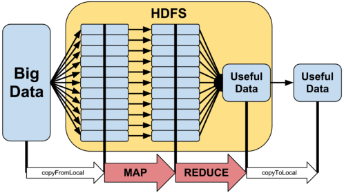

# Enumerable, зачем он нужен и чему нас учит

**Kottans-Ruby**, осень 2016

**Виктор Шепелев** (zverok)

# Кто я?

Виктор Шепелев (Обычно «Зверёк»/zverok в интернете)

* Ruby больше 10 лет
* Toptal
* Опенсорс: github.com/zverok
* Ruby Association Grant 2015
* Ruby-ментор последние 2 года (в т.ч. Google Summer of Code)

# А вы кто?

**Весёлая Викторина!** (без призов)

# А о чём мы вообще?

<% coderay do %>
File.read('data.txt')
  .each_with_index
  .map { |ln, i| [i, *ln.split('|')] }
  .map { |data| %i[num name salary].zip(data).to_h }
  .reject { |employee| employee[:salary] < 1_000 }
  .to_yaml
  .tap { |yml| File.write('salaries.yml', yml) }
<% end %>

# Enumerable: Функциональный стиль в Ruby

1. Что это такое и зачем это надо
2. Основные принципы
3. Как эти принципы реализованы в Ruby's Enumerable
4. Что нам это даёт
5. В глубины реализации
6. Ещё немного деталей

# Функциональное vs императивное

**Императивное**

* программа как последовательность _действий_
* меняем данные

<% coderay do %>
lines = File.read('data.txt')
lines.map! { |ln| ln.split('|') }
i = 0
lines.each { |ln| ln.unshift(i); i += 1  }
<% end %>

**Фукциональное**

* программа как последовательность _преобразований_
* не меняем данные, только порождаем новые

# Зачем стремиться к функциональному?

* Проще тестировать и отлаживать
* Меньше кода
* Проще обеспечить конкурентность
* Лучше выражает смысл

# Enumerable: полезные методы

<% coderay do %>
  # перечисляем
  (1..10).each { |i| p i }
  # преобразуем
  (1..10).map { |i| i ** 2}
  # выбираем
  (1..10).select(&:odd?)
  (1..10).reject { |i| < 5 }
  # проверяем
  (1..10).any?(&:even?)
  (1..10).all? { |i| i.is_a?(Numeric) }
  # статистика
  (1..10).max
  %w[one two three four].max_by(&:length)
  (1..10).sum
  %w[one two three four].group_by(&:length)
<% end %>

# Enumerable: ещё больше полезных методов!

<% coderay do %>
  # grep
  %w[foo bar baz].grep(/^f/)
  [1, :foo, 2, {}].grep(Numeric)

  # partition
  [1, :foo, 2, {}].partition { |v| v.is_a?(Numeric) }

  # reduce
  (1..20).reduce(:+)
  [картошка, колбаса, горошек].reduce(тарелка) { |тарелка_с_салатом, компонент|
    тарелка_с_салатом.положить(компонент)
  }
<% end %>

Тысячи их!

# Примечание

* Понимаешь `map`?
* Понимаешь `reduce`?
* Значит, знаешь парадигму Map-Reduce!

 

# Enumerable: цепочки методов

<% coderay do %>
File.read('data.txt')
  .each_with_index
  .map { |ln, i| [i, *ln.split('|')] }
  .map { |data| %i[num name salary].zip(data).to_h }
  .reject { |employee| employee[:salary] < 1_000 }
  .to_yaml
  .tap { |yml| File.write('salaries.yml', yml) }
<% end %>

# Сердце тьмы: proc, lambda и все-все-все

<% coderay do %>
(1..10).map { |i| i ** 2 }
# примерно то же самое что...
block = proc { |i| i ** 2 }
(1..10).map(&block)
<% end %>

Вопросы для самопроверки:

* `block` в коде выше — это объект? а какого класса?
* чем `proc` отличается от `lambda`?
* что такое «замыкание» и какое отношение оно имеет ко всему происходящему?

# Когда proc не proc

* `Symbol`

<% coderay do %>
[1, 2, 3].map(&:to_s)
<% end %>

* `Method`

<% coderay do %>
[1, 2, 3].each(&Kernel.method(:puts))
<% end %>

* ...anything!

<% coderay do %>
  require 'time_math'

  op = TimeMath().floor(:month).advance(:hour, 10)
  # => #<TimeMath::Op floor(:month).advance(:hour, 10)>
  %w[2016-02-01 2016-03-06 2016-04-15].map(&Time.method(:parse)).map(&op)
  # => [2016-02-01 10:00:00, 2016-03-01 10:00:00, 2016-04-01 10:00:00]
<% end %>

# Enumerable: Функциональный стиль в Ruby

1. <s>Что это такое и зачем это надо</s>
2. <s>Основные принципы</s>
3. <s>Как эти принципы реализованы в Ruby's Enumerable</s>
4. Что нам это даёт
5. В глубины реализации
6. Ещё немного деталей

_Здесь можно покурить._

# Мощь абстракций: Enumerator

<% coderay do %>
  (1..10).each
  # => #<Enumerator: 1..10:each>
  20.times
  # => #<Enumerator: 20:times>
  ('a'..'e').each_with_index.map
  # => #<Enumerator: #<Enumerator: "a".."e":each_with_index>:map>
  ('a'..'e').each_with_index.map.take(2)
<% end %>

# Мощь абстракций: lazy

<% coderay do %>
  # медленно:
  (1..10_000).reject(&:odd?).map(&:to_s).first(3)
  # быстро:
  (1..10_000).lazy # <-- MAGIC!!!
    .reject(&:odd?).map(&:to_s).first(3)
<% end %>

# Мощь абстракций: перечисление неисчислимого

<% coderay do %>
(1..Float::INFINITY).lazy.select(&:odd?).take_while { |i| i < 12 }.to_a
# => [1, 3, 5, 7, 9, 11]

socket.lazy.take_while { |b| b != 0 }
<% end %>

# Как сделать свой класс Enumerable-ом?

...просто добавь `each`!

<% coderay do %>
class ThreeLittlePigs
  def each
    yield 'Ниф-Ниф'
    yield 'Наф-Наф'
    yield 'Нуф-Нуф'
  end

  include Enumerable
end

ThreeLittlePigs.new.map(&:reverse)
# => ["фиН-фиН", "фaН-фaН", "фуН-фуН"]
<% end %>

# Явные и неявные аргументы

<% coderay do %>
  def each
    raise ArgumentError unless block_given?

    yield 'Ниф-Ниф'
    yield 'Наф-Наф'
    yield 'Нуф-Нуф'
  end

  def each(&block)
    raise ArgumentError unless block

    internal_data.each(&block)
  end
<% end %>

# Не забывать про Enumerator!

<% coderay do %>
ThreeLittlePigs.new.each
# LocalJumpError: no block given (yield)

class ThreeLittlePigs
  def each
    return to_enum(:each) unless block_given?

    yield 'Ниф-Ниф'
    yield 'Наф-Наф'
    yield 'Нуф-Нуф'
  end
end

ThreeLittlePigs.new.each
# => #<Enumerator: #<ThreeLittlePigs:0xa4c7c64>:each>
<% end %>

# Иногда Enumerator — это всё что нужно!

<% coderay do %>
class Day
  def each(&block)
    # каждый час дня
  end
  include Enumerable
end
day.map { ... } # hm?..
<% end %>

А если так?

<% coderay do %>
class Day
  def hours(&block)
    Enumerator.new { .... }
  end
end
day.hours.map { ... } # m!
<% end %>

# И ещё немного деталей

# Не Enumerable, но ...

<% coderay do %>
People.where { salary < 1000 }.order(:name).group(:department)
  .select(:department, :sum[:salary], :count[])
  .order(:count)
  .first(5)
<% end %>

# А Array — Enumerable?..

* Конечно, да!

* ...а также нет:
  * собственная реализация многих методов;
  * методы изменяющие данные.


# bang, no bang и как сломать функциональное программирование

Штуки, которые бывают полезными... или стреляют в ногу!

<% coderay do %>
  # bang-версии методов
  a = [1, 2, 3]
  a.map!(&:to_s)

  # методы изменяющие получателя
  a.concat([4, 5, 6])
  a.replace([7, 8, 9])
  a.clear

  # ...никогда не знаешь где их ожидать
  t = Time.now
  t.utc
<% end %>

# подлый `include?`

<% coderay do %>
allowed = IP.new("88.198.0.0")..IP.new("88.198.191.128")
allowed.include?(user_ip) # МЕДЛЕННО
allowed.cover?(user_ip) # быстро!
<% end %>

# ...и всякое такое

<% coderay do %>
200.times.map { rand(20) }
  .group_by(&:itself)
  .map { |n, group| [n, group.count] }.to_h
  .tap { |data| File.write('numers.yml', data.to_yaml) }
<% end %>

# Enumerable: Функциональный стиль в Ruby

1. <s>Что это такое и зачем это надо</s>
2. <s>Основные принципы</s>
3. <s>Как эти принципы реализованы в Ruby's Enumerable</s>
4. <s>Что нам это даёт</s>
5. <s>В глубины реализации</s>
6. <s>Ещё немного деталей</s>

# Enumerable: Функциональный стиль в Ruby

1. Что это такое и зачем это надо
2. Основные принципы
3. Как эти принципы реализованы в Ruby's Enumerable
4. Что нам это даёт
5. В глубины реализации
6. Ещё немного деталей

# Домашнее задание!

1. Модуль Ebuberable
2. Класс «последовательность бизнес-дней»
3. Класс для выбиралки из шахматной доски

(Будет также в чате и почте)

# 1. Модуль Ebuberable

Воплотить модуль `Ebuberable`: когда его включаешь в класс, он предоставляет методы:
* `map`;
* `select`;
* `reject`;
* `grep`;
* `all?`;
* `reduce`.

Дополнительное задание: реализовать как можно больше методов Enumerable

# 2. Класс «последовательность бизнес-дней»

<% coderay do %>
BusnessDays.new(start: Date.parse('2016-05-01'), region: :fr)
  .reject { |d| d.wday == 5 }.take(5)
# => возвращает 5 бизнес-дней, начиная с 1 мая, кроме пятниц
<% end %>

Использовать гем `holidays`.

# 3. Класс для работы с шахматной доской

<% coderay do %>
CHESSBOARD = (:a1..:h8)
position = Position.new(a1: :black_queen, e2: :white_queen, h5: :white_bishop, ...)
CHESSBOARD.map(&position).to_h # => {a1: :black_queen, a2: :empty, a3: :empty...}
CHESSBOARD.select(&position.occupied) # => [:a1, :e2, :h5 ...]
CHESSBOARD.select(&position.occupied(:queen)) # => [:a1, :e2]
<% end %>

Дополнительное задание: test driven development (подготовит вас к следующей лекции!)

# Спасибо!

Не переключайте канал.

Советы напоследок:

* Читайте доки
* Экспериментируйте
* Полюбите функциональный стиль

**Следующие лекции**:

* 5 ноября (суббота) — мастер-класс по метапрограммированию;
* 8 ноября (вторник) — лекция по RSpec.

